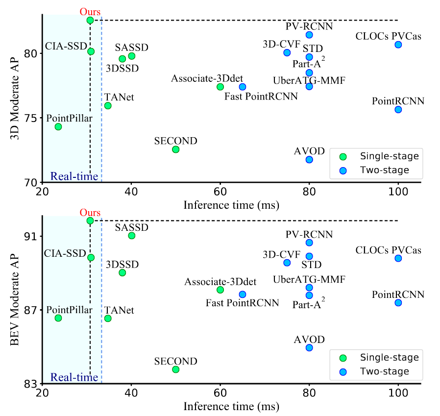
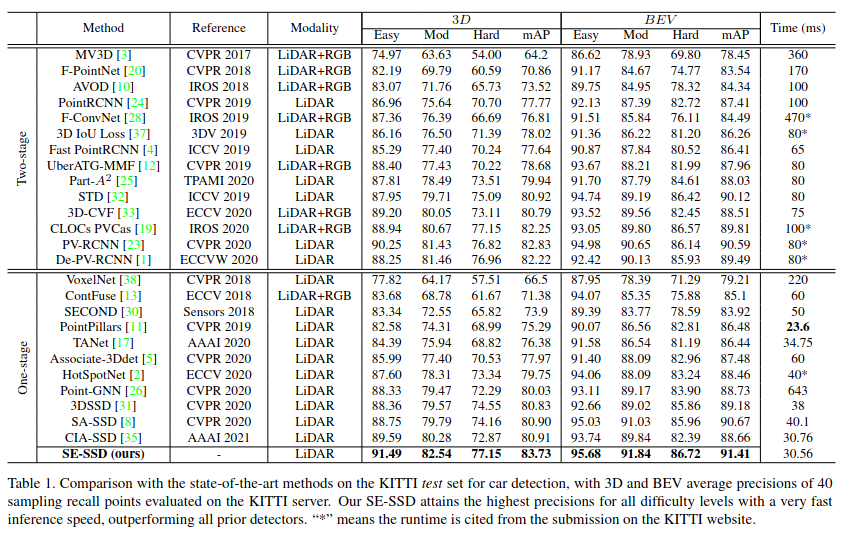

# Self-Ensembling Single Shot Detector (SESSD)
SE-SSD is a 3d-object-detection model: https://github.com/Vegeta2020/SE-SSD 


<p align="center">
    <i>detection-radius: </i> 50[m],  
    <i>benchmark: TITAN GTX, RTX 3060Ti</i><br>
    <i>Average inference time(180-degree)</i>: 30[ms] &asymp; 30[fps]<br>
    <i>Average inference time(360-degree)</i>: 65[ms] &asymp; 15[fps]<br> 
</p>

### Other Work
<table>
<tr>
    <td width=40%></td>
    <td width=60%></td>
</tr>
</table>
<br>

### Usage 
ignore the repo src just pull the docker image and follow the usage guide

```bash
$ docker pull loaywael/sessd:ros-torch1.9-cuda111
```


creating a container from this image.
```bash
$ docker run -itd --name SESSD_ROS --gpus all --net host --ipc host \
    -v <host-shared-path>:/shared_area loaywael/sessd:ros-torch1.9-cuda111
$ docker exec -it SESSD_ROS bash
```

run the demo node
```bash
# 1st option using roslaunch
# default kitti-bag for arl-bag set arl:=true
$ roslaunch se_ssd detect_3d_objects.launch kitti:=true weights_path:=<abs-path>
```
<br>

### [evaluation]
Reproduced the model results
```
Evaluation official_AP_11: car AP(Average Precision)@0.70, 0.70, 0.70:
bbox AP:99.04, 90.06, 89.47
bev  AP:90.59, 88.80, 87.84
3d   AP:90.05, 79.82, 78.80
aos  AP:99.01, 89.81, 89.00
car AP(Average Precision)@0.70, 0.50, 0.50:
bbox AP:99.04, 90.06, 89.47
bev  AP:99.09, 90.23, 89.76
3d   AP:99.05, 90.18, 89.68
aos  AP:99.01, 89.81, 89.00

Evaluation official_AP_40: car AP(Average Precision)@0.70, 0.70, 0.70:
bbox AP:99.63, 93.64, 90.99
bev  AP:96.65, 90.26, 87.58
3d   AP:93.56, 84.14, 81.21
aos  AP:99.60, 93.34, 90.50
car AP(Average Precision)@0.70, 0.50, 0.50:
bbox AP:99.63, 93.64, 90.99
bev  AP:99.67, 96.01, 93.44
3d   AP:99.66, 95.94, 93.35
aos  AP:99.60, 93.34, 90.50
```

### [supports]
- model inference given a directory of PointCloud binaries.
- integrated with ROS
- supports custom datasets
- support 360 degree detection

### [to-do]
- support multi-class prediction

